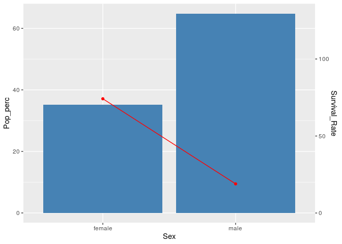
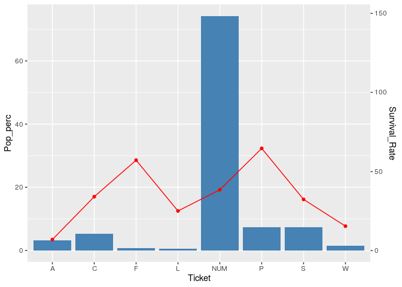
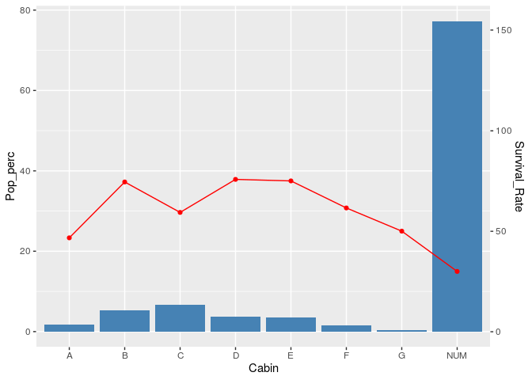
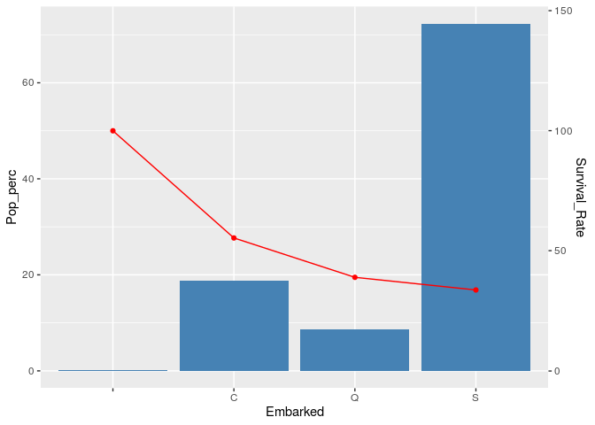
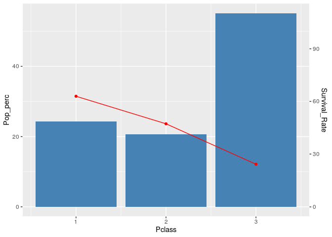
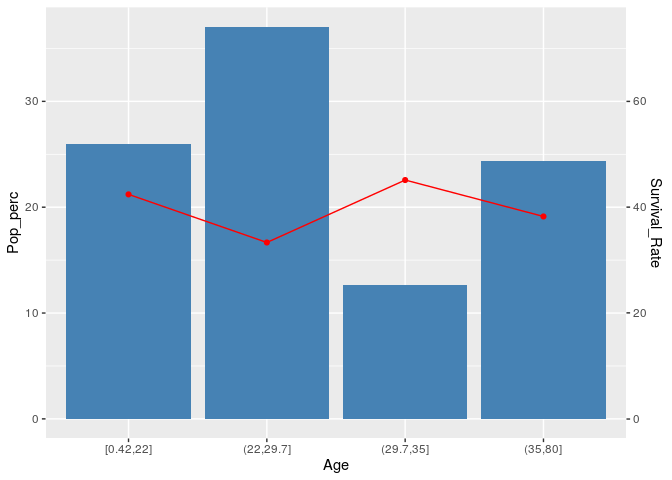
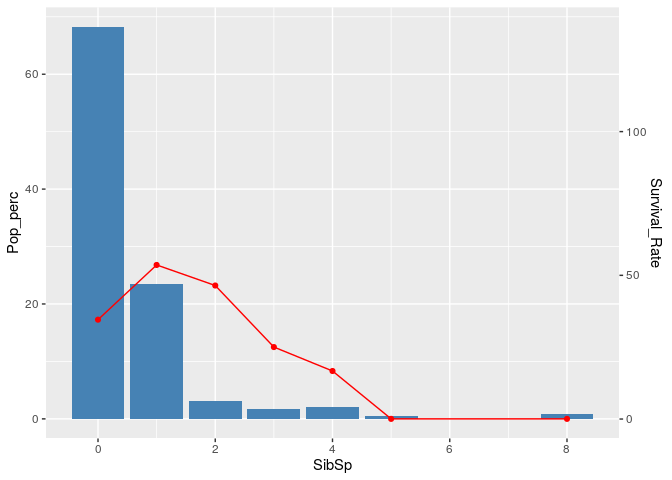
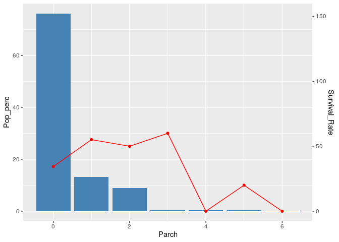
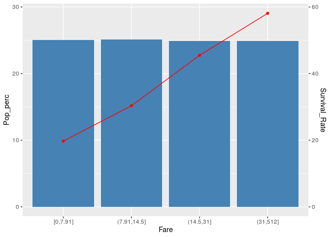
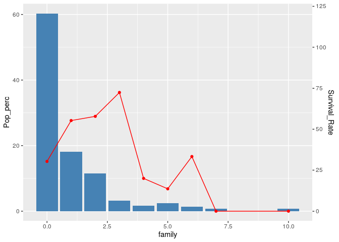

``` r
titanic_train_r %>% head()
```

    ##   PassengerId Survived Pclass
    ## 1           1        0      3
    ## 2           2        1      1
    ## 3           3        1      3
    ## 4           4        1      1
    ## 5           5        0      3
    ## 6           6        0      3
    ##                                                  Name    Sex Age SibSp Parch
    ## 1                             Braund, Mr. Owen Harris   male  22     1     0
    ## 2 Cumings, Mrs. John Bradley (Florence Briggs Thayer) female  38     1     0
    ## 3                              Heikkinen, Miss. Laina female  26     0     0
    ## 4        Futrelle, Mrs. Jacques Heath (Lily May Peel) female  35     1     0
    ## 5                            Allen, Mr. William Henry   male  35     0     0
    ## 6                                    Moran, Mr. James   male  NA     0     0
    ##             Ticket    Fare Cabin Embarked
    ## 1        A/5 21171  7.2500              S
    ## 2         PC 17599 71.2833   C85        C
    ## 3 STON/O2. 3101282  7.9250              S
    ## 4           113803 53.1000  C123        S
    ## 5           373450  8.0500              S
    ## 6           330877  8.4583              Q

``` r
## Size of train data
dim(titanic_train_r)
```

    ## [1] 891  12

``` r
## Features data types
str(titanic_train_r)
```

    ## 'data.frame':    891 obs. of  12 variables:
    ##  $ PassengerId: int  1 2 3 4 5 6 7 8 9 10 ...
    ##  $ Survived   : int  0 1 1 1 0 0 0 0 1 1 ...
    ##  $ Pclass     : int  3 1 3 1 3 3 1 3 3 2 ...
    ##  $ Name       : Factor w/ 891 levels "Abbing, Mr. Anthony",..: 109 191 358 277 16 559 520 629 417 581 ...
    ##  $ Sex        : Factor w/ 2 levels "female","male": 2 1 1 1 2 2 2 2 1 1 ...
    ##  $ Age        : num  22 38 26 35 35 NA 54 2 27 14 ...
    ##  $ SibSp      : int  1 1 0 1 0 0 0 3 0 1 ...
    ##  $ Parch      : int  0 0 0 0 0 0 0 1 2 0 ...
    ##  $ Ticket     : Factor w/ 681 levels "110152","110413",..: 524 597 670 50 473 276 86 396 345 133 ...
    ##  $ Fare       : num  7.25 71.28 7.92 53.1 8.05 ...
    ##  $ Cabin      : Factor w/ 148 levels "","A10","A14",..: 1 83 1 57 1 1 131 1 1 1 ...
    ##  $ Embarked   : Factor w/ 4 levels "","C","Q","S": 4 2 4 4 4 3 4 4 4 2 ...

``` r
## Features Description
#### PassengerId - RowIndex
#### Survived - Target Column(0 - Survived, 1 - Not Survived)
#### Pclass - Ticket Class(1 = 1st, 2 = 2nd, 3 = 3rd)
#### Name - Name of the passenger
#### Sex - "female","male"
#### Age - Passenger Age
#### SibSp - Number of Siblings+Spouse
#### Parch - Number of Parents+Children
#### Ticket - Ticket Number
#### Fare - Ticket Fare
#### Cabin - Cabin Number
#### Embarked - Point of Embarkation(C = Cherbourg, Q = Queenstown, S = Southampton)
```

``` r
## Adding New Column
titanic_train_r$family = titanic_train_r$SibSp+titanic_train_r$Parch
## Filtering Factor Columns
factor = colnames(titanic_train_r[,sapply(titanic_train_r, is.factor)])
factor = factor[-1]
## Name variable cannot be used so needs to be dropped
factor
```

    ## [1] "Sex"      "Ticket"   "Cabin"    "Embarked"

``` r
# Filtering Numerical Columns
numeric = colnames(titanic_train_r[,sapply(titanic_train_r, is.numeric)])
numeric = numeric[-1]
## ID column is dropped
numeric
```

    ## [1] "Survived" "Pclass"   "Age"      "SibSp"    "Parch"    "Fare"     "family"

``` r
independent = c(factor,numeric[-1])
independent
```

    ##  [1] "Sex"      "Ticket"   "Cabin"    "Embarked" "Pclass"   "Age"     
    ##  [7] "SibSp"    "Parch"    "Fare"     "family"

``` r
dependent = numeric[1]
dependent
```

    ## [1] "Survived"

``` r
train_data = titanic_train_r
## Treating Factor variables
#### Ticket Number
#### Taking the 1st character of Ticket Number
#### NAs are Ticker numbers that are numeric only
train_data$Ticket = substring(text = gsub(pattern = '[^A-za-z]',replacement = "",x = train_data$Ticket),first = 1,last = 1)
train_data$Ticket = ifelse(test = train_data$Ticket=="","NUM",train_data$Ticket)
table(train_data$Ticket)
```

    ## 
    ##   A   C   F   L NUM   P   S   W 
    ##  29  47   7   4 661  65  65  13

``` r
#### Cabin Number
train_data$Cabin = substring(text = gsub(pattern = '[^A-Za-z]',replacement = "",x = train_data$Cabin),first = 1,last = 1)
train_data$Cabin = ifelse(test = train_data$Cabin=="" | train_data$Cabin=="T","NUM",train_data$Cabin)
table(train_data$Cabin)
```

    ## 
    ##   A   B   C   D   E   F   G NUM 
    ##  15  47  59  33  32  13   4 688

``` r
#Finding NAs
mean_age = mean(train_data$Age,na.rm = T)
train_data$Age = ifelse(is.na(train_data$Age),mean_age,train_data$Age)
colSums(is.na(train_data[independent]))
```

    ##      Sex   Ticket    Cabin Embarked   Pclass      Age    SibSp    Parch 
    ##        0        0        0        0        0        0        0        0 
    ##     Fare   family 
    ##        0        0

``` r
#NAs Treatment
data_copy = train_data
```

``` r
# Binning Numeric Columns
train_data$Age = cut(x = train_data$Age,breaks = quantile(x = train_data$Age,probs = c(0,0.25,0.5,0.75,1),na.rm = T),include.lowest = T)

train_data$Fare = cut(x = train_data$Fare,breaks = quantile(x = train_data$Fare,probs = c(0,0.25,0.5,0.75,1),na.rm = T),include.lowest = T)
```

``` r
train_data %>% group_by(Sex) %>% summarise(Pop_perc = n()/nrow(train_data)*100,Survival_Rate = sum(Survived)/n()*100) %>% ggplot()+geom_bar(aes(x=Sex,y=Pop_perc),stat = 'identity',fill = "steelblue")+geom_point(aes(x=Sex,y=0.5*Survival_Rate),color = "red")+geom_line(aes(x=Sex,y=0.5*Survival_Rate),color = "red",group = 1)+scale_y_continuous(sec.axis = sec_axis(~./0.5, name = "Survival_Rate"))
```



``` r
train_data %>% group_by(Ticket) %>% summarise(Pop_perc = n()/nrow(train_data)*100,Survival_Rate = sum(Survived)/n()*100) %>% ggplot()+geom_bar(aes(x=Ticket,y=Pop_perc),stat = 'identity',fill = "steelblue")+geom_point(aes(x=Ticket,y=0.5*Survival_Rate),color = "red")+geom_line(aes(x=Ticket,y=0.5*Survival_Rate),color = "red",group = 1)+scale_y_continuous(sec.axis = sec_axis(~./0.5, name = "Survival_Rate"))
```



``` r
train_data %>% group_by(Cabin) %>% summarise(Pop_perc = n()/nrow(train_data)*100,Survival_Rate = sum(Survived)/n()*100) %>% ggplot()+geom_bar(aes(x=Cabin,y=Pop_perc),stat = 'identity',fill = "steelblue")+geom_point(aes(x=Cabin,y=0.5*Survival_Rate),color = "red")+geom_line(aes(x=Cabin,y=0.5*Survival_Rate),color = "red",group = 1)+scale_y_continuous(sec.axis = sec_axis(~./0.5, name = "Survival_Rate"))
```



``` r
train_data %>% group_by(Embarked) %>% summarise(Pop_perc = n()/nrow(train_data)*100,Survival_Rate = sum(Survived)/n()*100) %>% ggplot()+geom_bar(aes(x=Embarked,y=Pop_perc),stat = 'identity',fill = "steelblue")+geom_point(aes(x=Embarked,y=0.5*Survival_Rate),color = "red")+geom_line(aes(x=Embarked,y=0.5*Survival_Rate),color = "red",group = 1)+scale_y_continuous(sec.axis = sec_axis(~./0.5, name = "Survival_Rate"))
```



``` r
train_data %>% group_by(Pclass) %>% summarise(Pop_perc = n()/nrow(train_data)*100,Survival_Rate = sum(Survived)/n()*100) %>% ggplot()+geom_bar(aes(x=Pclass,y=Pop_perc),stat = 'identity',fill = "steelblue")+geom_point(aes(x=Pclass,y=0.5*Survival_Rate),color = "red")+geom_line(aes(x=Pclass,y=0.5*Survival_Rate),color = "red",group = 1)+scale_y_continuous(sec.axis = sec_axis(~./0.5, name = "Survival_Rate"))
```



``` r
train_data %>% group_by(Age) %>% summarise(Pop_perc = n()/nrow(train_data)*100,Survival_Rate = sum(Survived)/n()*100) %>% ggplot()+geom_bar(aes(x=Age,y=Pop_perc),stat = 'identity',fill = "steelblue")+geom_point(aes(x=Age,y=0.5*Survival_Rate),color = "red")+geom_line(aes(x=Age,y=0.5*Survival_Rate),color = "red",group = 1)+scale_y_continuous(sec.axis = sec_axis(~./0.5, name = "Survival_Rate"))
```



``` r
train_data %>% group_by(SibSp) %>% summarise(Pop_perc = n()/nrow(train_data)*100,Survival_Rate = sum(Survived)/n()*100) %>% ggplot()+geom_bar(aes(x=SibSp,y=Pop_perc),stat = 'identity',fill = "steelblue")+geom_point(aes(x=SibSp,y=0.5*Survival_Rate),color = "red")+geom_line(aes(x=SibSp,y=0.5*Survival_Rate),color = "red",group = 1)+scale_y_continuous(sec.axis = sec_axis(~./0.5, name = "Survival_Rate"))
```



``` r
train_data %>% group_by(Parch) %>% summarise(Pop_perc = n()/nrow(train_data)*100,Survival_Rate = sum(Survived)/n()*100) %>% ggplot()+geom_bar(aes(x=Parch,y=Pop_perc),stat = 'identity',fill = "steelblue")+geom_point(aes(x=Parch,y=0.5*Survival_Rate),color = "red")+geom_line(aes(x=Parch,y=0.5*Survival_Rate),color = "red",group = 1)+scale_y_continuous(sec.axis = sec_axis(~./0.5, name = "Survival_Rate"))
```



``` r
train_data %>% group_by(Fare) %>% summarise(Pop_perc = n()/nrow(train_data)*100,Survival_Rate = sum(Survived)/n()*100) %>% ggplot()+geom_bar(aes(x=Fare,y=Pop_perc),stat = 'identity',fill = "steelblue")+geom_point(aes(x=Fare,y=0.5*Survival_Rate),color = "red")+geom_line(aes(x=Fare,y=0.5*Survival_Rate),color = "red",group = 1)+scale_y_continuous(sec.axis = sec_axis(~./0.5, name = "Survival_Rate"))
```



``` r
train_data %>% group_by(family ) %>% summarise(Pop_perc = n()/nrow(train_data)*100,Survival_Rate = sum(Survived)/n()*100) %>% ggplot()+geom_bar(aes(x=family ,y=Pop_perc),stat = 'identity',fill = "steelblue")+geom_point(aes(x=family ,y=0.5*Survival_Rate),color = "red")+geom_line(aes(x=family ,y=0.5*Survival_Rate),color = "red",group = 1)+scale_y_continuous(sec.axis = sec_axis(~./0.5, name = "Survival_Rate"))
```



``` r
train_data = data_copy
set.seed(123)
#install.packages('e1071')
library(e1071)
## Decision Tree Classifier

model<-tree(Survived~.,data = train_data[c(dependent,independent)])
```

    ## Warning in tree(Survived ~ ., data = train_data[c(dependent, independent)]): NAs
    ## introduced by coercion

``` r
predicted<-predict(model,newdata = train_data[independent])
```

    ## Warning in pred1.tree(object, tree.matrix(newdata)): NAs introduced by coercion

``` r
predict = ifelse(predicted<0.5,0,1)
confusionMatrix(as.factor(train_data$Survived),as.factor(predict),positive = "1")
```

    ## Confusion Matrix and Statistics
    ## 
    ##           Reference
    ## Prediction   0   1
    ##          0 492  57
    ##          1  97 245
    ##                                           
    ##                Accuracy : 0.8272          
    ##                  95% CI : (0.8007, 0.8514)
    ##     No Information Rate : 0.6611          
    ##     P-Value [Acc > NIR] : < 2.2e-16       
    ##                                           
    ##                   Kappa : 0.6264          
    ##                                           
    ##  Mcnemar's Test P-Value : 0.001674        
    ##                                           
    ##             Sensitivity : 0.8113          
    ##             Specificity : 0.8353          
    ##          Pos Pred Value : 0.7164          
    ##          Neg Pred Value : 0.8962          
    ##              Prevalence : 0.3389          
    ##          Detection Rate : 0.2750          
    ##    Detection Prevalence : 0.3838          
    ##       Balanced Accuracy : 0.8233          
    ##                                           
    ##        'Positive' Class : 1               
    ## 

``` r
model<-rpart(Survived~.,data = train_data[c(dependent,independent)])
predicted<-predict(model,newdata = train_data[independent])
predict<-ifelse(predicted<0.5,"0","1")
confusionMatrix(as.factor(train_data$Survived),as.factor(predict),positive = "1")
```

    ## Confusion Matrix and Statistics
    ## 
    ##           Reference
    ## Prediction   0   1
    ##          0 487  62
    ##          1  95 247
    ##                                           
    ##                Accuracy : 0.8238          
    ##                  95% CI : (0.7972, 0.8483)
    ##     No Information Rate : 0.6532          
    ##     P-Value [Acc > NIR] : < 2e-16         
    ##                                           
    ##                   Kappa : 0.6206          
    ##                                           
    ##  Mcnemar's Test P-Value : 0.01065         
    ##                                           
    ##             Sensitivity : 0.7994          
    ##             Specificity : 0.8368          
    ##          Pos Pred Value : 0.7222          
    ##          Neg Pred Value : 0.8871          
    ##              Prevalence : 0.3468          
    ##          Detection Rate : 0.2772          
    ##    Detection Prevalence : 0.3838          
    ##       Balanced Accuracy : 0.8181          
    ##                                           
    ##        'Positive' Class : 1               
    ## 

``` r
train_data$Survived = as.factor(train_data$Survived)
model<-boosting(Survived~.,data =  train_data[c(dependent,independent)],mfinal = 20)
predicted<-predict.boosting(model, train_data[independent])
predict<-ifelse(predicted$prob[,2]<0.5,"0","1")
confusionMatrix(as.factor(train_data$Survived),as.factor(predict),positive = "1")
```

    ## Confusion Matrix and Statistics
    ## 
    ##           Reference
    ## Prediction   0   1
    ##          0 518  31
    ##          1  50 292
    ##                                           
    ##                Accuracy : 0.9091          
    ##                  95% CI : (0.8883, 0.9272)
    ##     No Information Rate : 0.6375          
    ##     P-Value [Acc > NIR] : <2e-16          
    ##                                           
    ##                   Kappa : 0.8058          
    ##                                           
    ##  Mcnemar's Test P-Value : 0.0455          
    ##                                           
    ##             Sensitivity : 0.9040          
    ##             Specificity : 0.9120          
    ##          Pos Pred Value : 0.8538          
    ##          Neg Pred Value : 0.9435          
    ##              Prevalence : 0.3625          
    ##          Detection Rate : 0.3277          
    ##    Detection Prevalence : 0.3838          
    ##       Balanced Accuracy : 0.9080          
    ##                                           
    ##        'Positive' Class : 1               
    ## 

``` r
dummy_obj = dummyVars(~., data=train_data[independent])
titanic_new = data.frame(predict(dummy_obj, newdata = train_data[independent]))

## Normalizing
titanic_norm = normalize(titanic_new, method='range', range = c(0,1))
colSums(is.na(train_data))
```

    ## PassengerId    Survived      Pclass        Name         Sex         Age 
    ##           0           0           0           0           0           0 
    ##       SibSp       Parch      Ticket        Fare       Cabin    Embarked 
    ##           0           0           0           0           0           0 
    ##      family 
    ##           0

``` r
predict=knn(train = titanic_norm,test = titanic_norm,cl = as.factor(train_data$Survived),k = 5)
confusionMatrix(predict, as.factor(train_data$Survived), positive = '1')
```

    ## Confusion Matrix and Statistics
    ## 
    ##           Reference
    ## Prediction   0   1
    ##          0 496  81
    ##          1  53 261
    ##                                           
    ##                Accuracy : 0.8496          
    ##                  95% CI : (0.8244, 0.8725)
    ##     No Information Rate : 0.6162          
    ##     P-Value [Acc > NIR] : < 2e-16         
    ##                                           
    ##                   Kappa : 0.6771          
    ##                                           
    ##  Mcnemar's Test P-Value : 0.01968         
    ##                                           
    ##             Sensitivity : 0.7632          
    ##             Specificity : 0.9035          
    ##          Pos Pred Value : 0.8312          
    ##          Neg Pred Value : 0.8596          
    ##              Prevalence : 0.3838          
    ##          Detection Rate : 0.2929          
    ##    Detection Prevalence : 0.3524          
    ##       Balanced Accuracy : 0.8333          
    ##                                           
    ##        'Positive' Class : 1               
    ##
